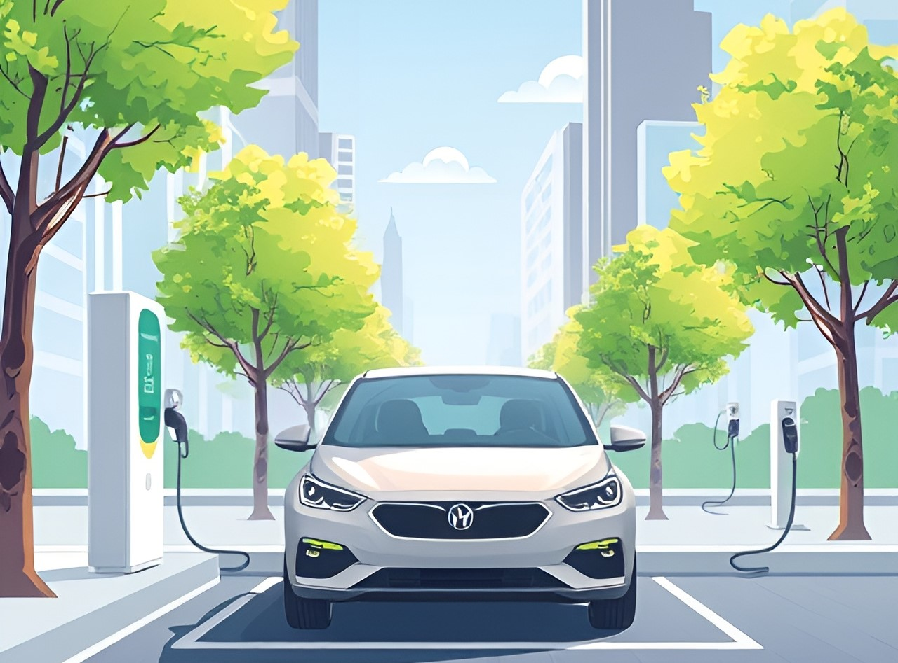

# MADE: Methods of Advanced Data Engineering

MADE is module at FAU.
This repository contains:
-  a data science project that is developed by the student over the course of the semester.
-  the exercises that are submitted over the course of the semester.

## Project: Impact of EV adoption on air pollution.

The adoption of electric vehicles (EVs) has been widely promoted as a means to mitigate urban air pollution. This report examines the relationship between the growth of EV adoption in King County, Washington, particularly in Seattle, and its influence on air quality from 2016 to 2024.

